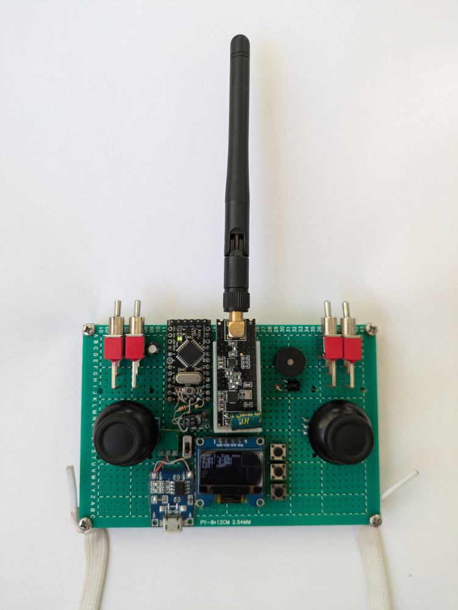

# LowcostRC

LowcostRC is low price remote control system based on Arduino.

<figure>
    
    <figcaption>Transmitter with nRF24L01 module</figcaption>
</figure>
<a href="Documentation/Images">More images</a>

## Hardware

The following main components are used for the transmitter:

- Arduino Pro Mini as main MCU
- nRF24L01 or ESP8266 as radio module
- 0.96" SSD1306 OLED Display
- Two 2-axis joysticks

Receiver can be build using Arduino + nRF24L01 or a single ESP8266.

## Transmitter features
 
- 8 control channels
- Pluggable radio modules (nRF24L01 or ESP8266)
- User interface with monochrome display and 3 buttons
- Multiple profiles (models) can be stored in EEPROM
- Using UI it's possible to change various control and radio link parameters
  like channels mapping, trimming, double rate, radio channel, radio power, etc
- Maximum transmission packet rate is about 270 packets per second on Arduino
  Pro Mini 3.3v 8MHz and nRF24L01 on both sides

## Directory structure

<a href="LowcostRC_Core">LowcostRC_Core</a>
: Core library

<a href="LowcostRC_Rx">LowcostRC_Rx</a>
: Core receiver library

<a href="LowcostRC_Rx_ESP8266">LowcostRC_Rx_ESP8266</a>
: ESP8266 receiver library

<a href="LowcostRC_Rx_nRF24">LowcostRC_Rx_nRF24</a>
: nRF24L01 receiver library

<a href="Transmitter">Transmitter</a>
: Transmitter code

<a href="Transmitter_JS">Transmitter_JS</a>
: Transmitter code adapted for Joystick Shield V1.A (no UI, hardcoded
parameters)

<a href="Receiver_1S">Receiver_1S</a>
: Sample receiver sketch for plane. 1S power, nRF24L01 radio, brushed motor.

<a href="Receiver_2S">Receiver_2S</a>
: Sample receiver sketch for plane. 2S power, nRF24L01 radio, brushless motor.

<a href="Receiver_ESP8266">Receiver_ESP8266</a>
: Sample receiver sketch for plane. 1S power, ESP8266 radio, brushed motor.

<a href="Receiver_Sim">Receiver_Sim</a>
: Sample receiver sketch to use with flight simulator on PC. Based on Arduino
Pro Micro and nRF24L01. Arduino connects to PC using USB cable and recognized as
gamepad device with 8 axis.

<a href="Documentation/Schematics">Documentation/Schematics</a>
: Schematics

<a href="Documentation/Images">Documentation/Images</a>
: Photos

To compile and flush you need Arduino IDE or Arduino CLI. In order for the
compiler can see the libraries you need to copy (or make symlinks)
`lowcostRC_*` directories to Arduino libraries directory.
